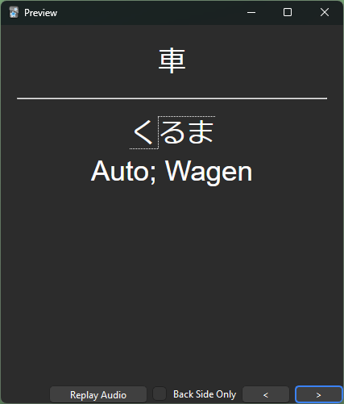

# PitchHTML

## GitHub Pages Link

<https://krippix.github.io/PitchHTML/>

## Description

A small webapp I created in order to include pitch notation for japanese vocabulary.

To add HTML-formatted stuff to Anki cards use `ctrl + shift + x`

